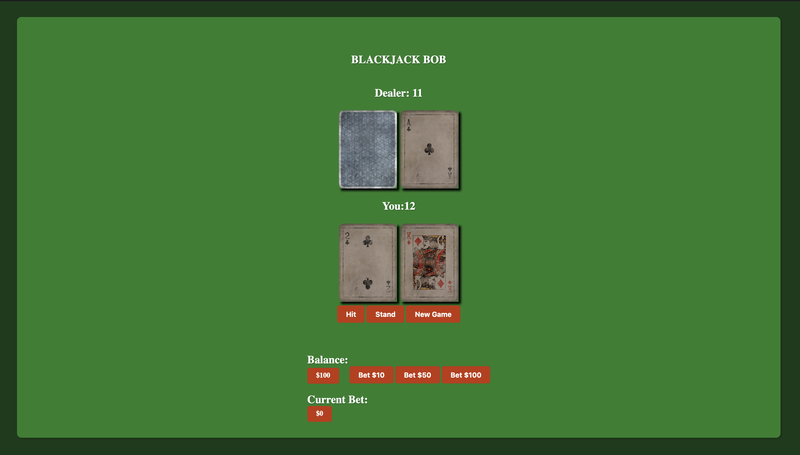

# BlackJackBob [Play here](https://blackjackbob.netlify.app/)

## Getting Started
This is a simple JavaScript implementation of the classic casino card game, Blackjack. The game allows a single player to play against a dealer, with the objective of reaching a score of 21 or as close as possible without going over.

## How to Play 
At the beginning of each round, the player is dealt two cards, which are displayed on the screen. The dealer is also dealt two cards, but only one card is displayed on the screen.

The player must then decide whether to hit (receive another card) or stand (keep their current hand). The player can continue to hit until they reach a score of 21 or they bust (exceed a score of 21).

Once the player has stood, the dealer will reveal their second card and continue to hit until they reach a score of 17 or higher. If the dealer busts, the player wins. If the player's score is higher than the dealer's score without busting, the player wins. If the dealer's score is higher than the player's score without busting, the dealer wins. If both the player and the dealer have the same score, it is a tie.

##Technologies Used
The following technologies were used to build this game:

- HTML
- CSS
- JavaScript

## Assets Used:
### [Cards](https://opengameart.org/content/vintage-playing-cards)

## Next Steps
- [ ] Mobile Compatability 
- [ ] Double Down Mechanics 
- [ ] Split Mechanics 
- [ ] Surrender Mechanics 
- [ ] Animation and Sound bites
- [ ] More Polished CSS